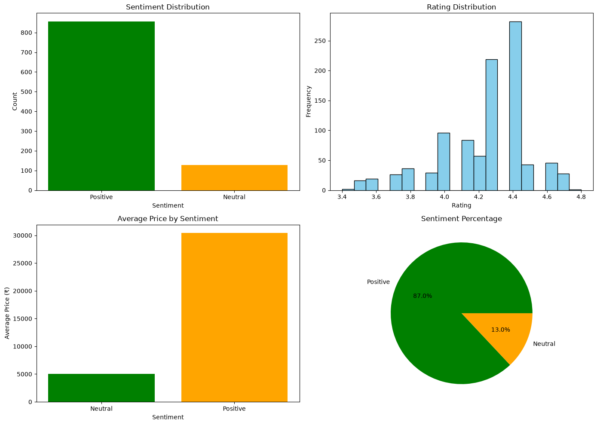

# Flipkart Product Review Scraper

A Python-based web scraping project for collecting Flipkart product links, organizing product data, and preparing it for review analysis and sentiment modeling.

## Overview

This project demonstrates a complete data collection workflow for Flipkart mobile products. It scrapes product listing pages, extracts product URLs, stores them in CSV format, and prepares a structured table that can later be used for product review scraping and sentiment analysis.

## What This Project Includes

- Flipkart search page scraping
- Product link extraction from multiple pages
- Product table creation for downstream analysis
- Notebook-based workflow for experimentation
- CSV exports for easy data handling

## Project Structure

```text
Flipkart Mobile webScrapping/
├── Flipkart_webScrapping.ipynb
├── review_rating_vader_&_Roberta_ML_Model.ipynb
├── flipkart_mobiles.csv
├── flipkart_mobiles_with_sentiment.csv
├── README.md
```

## Requirements

Install the required Python libraries:

```bash
pip install requests beautifulsoup4 pandas numpy nltk textblob vaderSentiment matplotlib seaborn jupyter
```

## How to Use

### 1. Open the notebook

Run Jupyter Notebook and open the main notebook:

```bash
jupyter notebook
```

### 2. Run the scraping workflow

Use the notebook cells to:
- scrape Flipkart search results,
- extract mobile product details,
- save the dataset to CSV,
- perform sentiment analysis.

### 3. Review the output files

The generated outputs include:
- `flipkart_mobiles.csv`
- `flipkart_mobiles_with_sentiment.csv`

## Output Files

- `flipkart_mobiles.csv`: scraped product data
- `flipkart_mobiles_with_sentiment.csv`: sentiment-enhanced dataset



## Notes

- Flipkart may limit requests if scraping too aggressively, so adding delays between requests is recommended.
- Some pages may require extra handling for dynamic content and review extraction.
- This project is intended for learning, experimentation, and portfolio demonstration.

## Future Improvements

- Add full review scraping for each product page
- Improve product link extraction logic
- Add more advanced NLP-based sentiment analysis
- Create a dashboard for visualization

## License

This project is for educational and demonstration purposes.

## Author

Imtiyaj Ali Shaikh# flipkart-product-review-scraper
